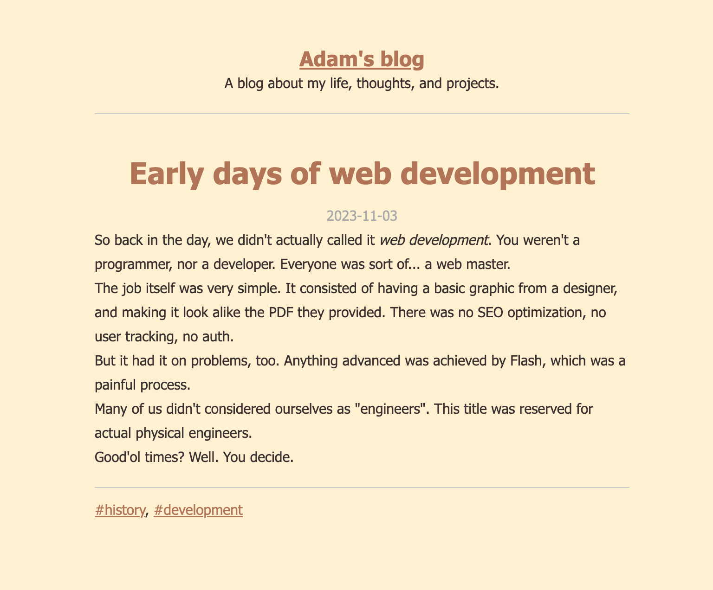

# Zin - Minimalistic PHP SSG Blogging Platform

This is a simple PHP blogging platform that allows you to write articles in plain Markdown files. The platform generates a static site with an archive, individual post pages and tag pages.
It uses the Front Matter syntax to create the title, date, slug and tags.



## Features

- Simple Markdown support (links, bold, italic, headings, lists, blockquotes, paragraphs, and horizontal lines).
- Generates an HTML archive of all posts.
- Individual post pages with metadata (title, date, tags).
- Tag pages displaying all posts associated with a specific tag.
- Easy to deploy; no external dependencies other than a PHP interpreter.

## Requirements

To run this platform, you will need:

- A web server with PHP support (PHP 7.0 or higher).
- Basic file system access (to upload files and create directories).


## Usage

1. **Setup the project:**
   - Clone the repository
   - run `php generate.php` (First run will create the folders, then it builds the blog)

2. **Create Markdown files:**
   - Add your Markdown files to the `content/` directory. Each file should follow this structure:
     ```markdown
     ---
     title: Your Post Title
     date: YYYY-MM-DD
     tags: tag1, tag2
     ---
     Your content here.
     ```

     Date and tags are optional.

4. **Access your site:**
   - After running the script, the generated HTML files will be available in the `public/` directory. You can upload this directory to your web server.

5. **Set up the general blog info**
   - in the `config.md`, modify the details to your liking. There is also a theme specified. Current themes are: `desert`
   - `site_lang` uses standardised 2-letter language specification (ISO 639-1)  
   ```markdown
   ---
   site_name: Your blog's title
   site_description: A blog about my life, thoughts, and projects.
   color_scheme: desert
   site_lang: en
   site_url: url-for-the-rss-feed
   ---
     ```


## Notes

- The script will create the necessary directories if they do not already exist.
- Ensure that the file permissions are set correctly so the PHP script can write to the `public/` directory.
- If brave enough, write via ssh on the server directly. If not, simply automate the upload of `public/` via ssh or sftp's put.

## License

This project is licensed under the GPL License. Feel free to use, modify, and distribute it as you wish.
